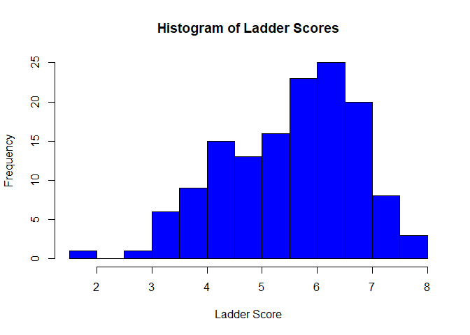
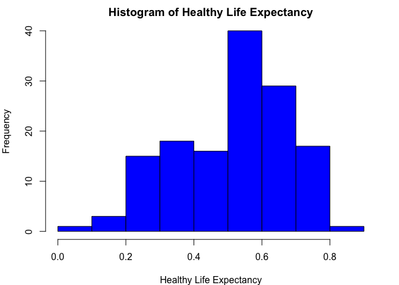
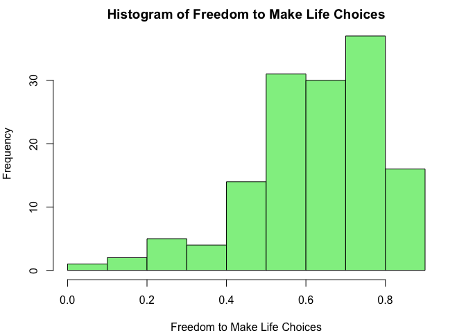
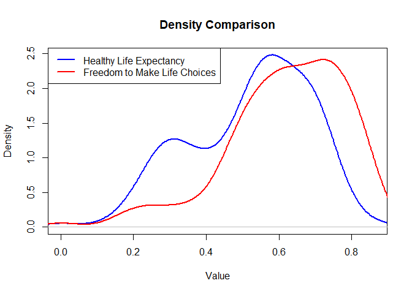
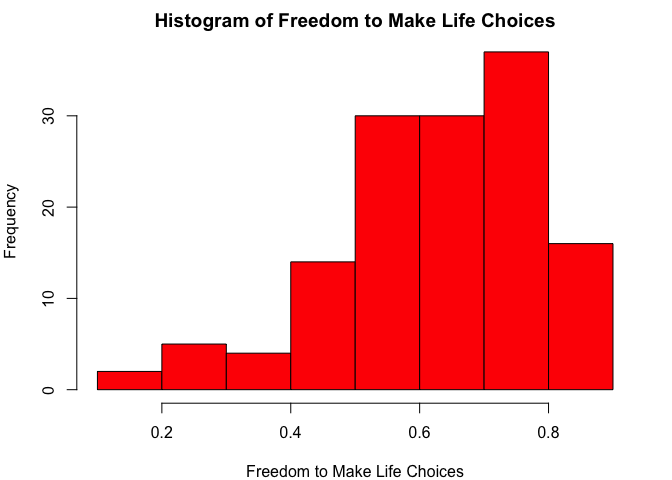
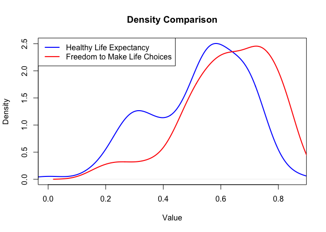

DS 202 Final Project
================

<!-- README.md is generated from README.Rmd. Please edit the README.Rmd file -->

This repository serves as a starter repo for your final project, and
this Rmd is supposed to serve as a starter file for your project report.

# Analysis of Worldwide Ladder Score

Authors: Cassandra Larsen, Chen Sang

# Intro

The goal of this project was to find out what varibles impacted the
ladder score, which is this data’s indicator of a happines score. We
were intrested in this topic as we are trying to find out where we wish
to possibly move after the conculsion of our undergraduate degree for
either a job or for a more advnced degree. We looked into the best
countries to live in terms of having the happiest citizens and analyzing
what factors contributed to the ladder score the most and the least, as
well as looking into trends in these varibles thatg impact the
laterscore

In pursuit of the stated goal, we will explore the following questions:

#### **Trend Analysis:**

- What is the relationship between the ‘Ladder score’ and ‘GDP per
  capita’?

- Does ‘Social support’ correlate strongly with the ‘Ladder score’?

- What variable(s) have the largest impact on ladder score that are also
  statistically significant?

**Comparative Analysis**:

- Which countries have the highest ‘Ladder score’?

- How do factors like ‘Generosity’ and ‘Perceptions of corruption’ vary
  among the top 10 happiest countries compared to the bottom 10?

**Distribution Analysis**:

- What is the distribution of the ‘Ladder score’ across all countries?
  Is it normally distributed?

- How does the distribution of ‘Healthy life expectancy’ compare to that
  of ‘Freedom to make life choices’?

# Quick Data Summary

**Relevant Variables from Dataset**:

- Ladder_score: ladder score of each country which is this data’s
  happiness score

- Explained_by_Log_GDP_per_capita: measure of a country’s economic
  output that accounts for its number of people

- Country_name: country’s name

- Explained_by_Social_support: interpersonal connections and community
  resources contribute to individual and collective well-being.

- Explained_by_Generosity: measures the average prevalence of generosity
  within a country

- Explained_by_Perceptions_of_corruption: level of corruption perception
  within political institutions and businesses

- Explained_by_Healthy_life_expectancy: measures the average number of
  years that a person is expected to live in full health

- Explained_by_Freedom_to_make_life_choices: measures the individuals’
  perceived freedom to make life choices, reflecting how free people
  feel to choose the course of their lives, including major decisions
  about careers, education, and family life

**Cleaning data:**

``` r
# Remove rows with any null values
clean_Happy_data <- na.omit(happy_score)

# Replace dots with underscores in column names
names(clean_Happy_data) <- gsub("\\.+", "_", names(clean_Happy_data))

# Now the column names have underscores instead of dots
head(names(clean_Happy_data))
```

    ## [1] "Country_name"                    "Ladder_score"                   
    ## [3] "upperwhisker"                    "lowerwhisker"                   
    ## [5] "Explained_by_Log_GDP_per_capita" "Explained_by_Social_support"

``` r
# View the cleaned data
head(clean_Happy_data)
```

    ##   Country_name Ladder_score upperwhisker lowerwhisker
    ## 1      Finland        7.741        7.815        7.667
    ## 2      Denmark        7.583        7.665        7.500
    ## 3      Iceland        7.525        7.618        7.433
    ## 4       Sweden        7.344        7.422        7.267
    ## 5       Israel        7.341        7.405        7.277
    ## 6  Netherlands        7.319        7.383        7.256
    ##   Explained_by_Log_GDP_per_capita Explained_by_Social_support
    ## 1                           1.844                       1.572
    ## 2                           1.908                       1.520
    ## 3                           1.881                       1.617
    ## 4                           1.878                       1.501
    ## 5                           1.803                       1.513
    ## 6                           1.901                       1.462
    ##   Explained_by_Healthy_life_expectancy
    ## 1                                0.695
    ## 2                                0.699
    ## 3                                0.718
    ## 4                                0.724
    ## 5                                0.740
    ## 6                                0.706
    ##   Explained_by_Freedom_to_make_life_choices Explained_by_Generosity
    ## 1                                     0.859                   0.142
    ## 2                                     0.823                   0.204
    ## 3                                     0.819                   0.258
    ## 4                                     0.838                   0.221
    ## 5                                     0.641                   0.153
    ## 6                                     0.725                   0.247
    ##   Explained_by_Perceptions_of_corruption Dystopia_residual
    ## 1                                  0.546             2.082
    ## 2                                  0.548             1.881
    ## 3                                  0.182             2.050
    ## 4                                  0.524             1.658
    ## 5                                  0.193             2.298
    ## 6                                  0.372             1.906

# Results

### **Trend Analysis:**

- **What is the relationship between the ‘Ladder score’ and ‘GDP per
  capita’?**

  - A linear regression analysis can help us understand how much of the
    variation in **`Ladder_score`** can be explained by
    **`Explained_by_Log_GDP_per_capita`**

  ``` r
  # Perform linear regression
  linearModel <- lm(Ladder_score ~ Explained_by_Log_GDP_per_capita, data = clean_Happy_data)

  # Summary of the regression model to see coefficients and statistics
  summary(linearModel)
  ```

      ## 
      ## Call:
      ## lm(formula = Ladder_score ~ Explained_by_Log_GDP_per_capita, 
      ##     data = clean_Happy_data)
      ## 
      ## Residuals:
      ##      Min       1Q   Median       3Q      Max 
      ## -2.81221 -0.35486  0.06285  0.42074  1.53252 
      ## 
      ## Coefficients:
      ##                                 Estimate Std. Error t value Pr(>|t|)    
      ## (Intercept)                       2.4252     0.2112   11.48   <2e-16 ***
      ## Explained_by_Log_GDP_per_capita   2.2469     0.1455   15.44   <2e-16 ***
      ## ---
      ## Signif. codes:  0 '***' 0.001 '**' 0.01 '*' 0.05 '.' 0.1 ' ' 1
      ## 
      ## Residual standard error: 0.692 on 136 degrees of freedom
      ## Multiple R-squared:  0.6368, Adjusted R-squared:  0.6342 
      ## F-statistic: 238.5 on 1 and 136 DF,  p-value: < 2.2e-16

  ``` r
  # Plotting the data points
  plot(clean_Happy_data$Explained_by_Log_GDP_per_capita, clean_Happy_data$Ladder_score, 
       main = "Relationship between Ladder Score and Log GDP per Capita",
       xlab = "Log GDP per Capita (Explained part)",
       ylab = "Ladder Score",
       pch = 19, col = "blue")

  # Adding the regression line
  abline(linearModel, col = "red", lwd = 2)

  # Enhancing the plot with grid lines for better readability
  grid(nx = NULL, ny = NULL, col = "gray", lty = "dotted")
  ```

  <!-- -->

- Results

  - **Positive Relationship**: There’s a clear positive correlation
    between Log GDP per Capita and Ladder Score. This suggests that as
    the economic output per capita increases, the happiness score tends
    to increase as well. This is indicated by the upward slope of the
    red regression line.

  - **Strength of the Relationship**: The spread of the blue points
    around the regression line suggests that while GDP per capita
    explains a significant portion of the variance in happiness scores,
    there are also other factors that influence happiness since the
    points are not perfectly aligned along the line. This is consistent
    with the R-squared value from your regression summary (approximately
    0.63), indicating that around 63% of the variation in Ladder Score
    can be explained by GDP per capita.

  - **Statistical Significance**: The regression coefficients for the
    intercept and Log GDP per capita are both statistically significant
    (p-values \< 2.2e-16), indicating a very low probability that these
    results are due to random chance.

- **Does ‘Social support’ correlate strongly with the ‘Ladder score’?**

  - Pearson correlation coefficient, which quantifies the strength and
    direction of the relationship, and to create a scatter plot with a
    regression line to visually assess the relationship.

``` r
# Calculate Pearson correlation coefficient
correlation <- cor(clean_Happy_data$Explained_by_Social_support, clean_Happy_data$Ladder_score, use = "complete.obs")
print(paste("Pearson correlation coefficient between Social Support and Ladder Score is:", correlation))
```

    ## [1] "Pearson correlation coefficient between Social Support and Ladder Score is: 0.798276334164571"

``` r
# Plotting the data points
plot(clean_Happy_data$Explained_by_Social_support, clean_Happy_data$Ladder_score, 
     main = "Relationship between Social Support and Ladder Score",
     xlab = "Social Support",
     ylab = "Ladder Score",
     pch = 19, col = "blue")

# Fit a linear model and add the regression line to the plot
model <- lm(Ladder_score ~ Explained_by_Social_support, data = clean_Happy_data)
abline(model, col = "red", lwd = 2)

# Add grid lines for better readability
grid(nx = NULL, ny = NULL, col = "gray", lty = "dotted")
```

<!-- -->

- Results

  - **Strength of Relationship**: A correlation coefficient of 0.79 is
    quite high, suggesting a strong association between the levels of
    social support in a country and its reported happiness (Ladder
    Score).

  - **Direction of Relationship**: Since the correlation coefficient is
    positive, it means that as social support increases, the Ladder
    Score generally increases as well. This implies that countries with
    higher levels of social support tend to have higher happiness
    scores.

- **What variable(s) have the largest impact on ladder score that are
  also statistically significant?**

  ``` r
  # Fit the multiple linear regression model
  Mmodel <- lm(Ladder_score ~ Explained_by_Log_GDP_per_capita + Explained_by_Social_support + Explained_by_Healthy_life_expectancy + Explained_by_Freedom_to_make_life_choices + Explained_by_Generosity + Explained_by_Perceptions_of_corruption, data = clean_Happy_data)


  # Summary of the model to see coefficients, R-squared, etc.
  summary(Mmodel)
  ```

      ## 
      ## Call:
      ## lm(formula = Ladder_score ~ Explained_by_Log_GDP_per_capita + 
      ##     Explained_by_Social_support + Explained_by_Healthy_life_expectancy + 
      ##     Explained_by_Freedom_to_make_life_choices + Explained_by_Generosity + 
      ##     Explained_by_Perceptions_of_corruption, data = clean_Happy_data)
      ## 
      ## Residuals:
      ##      Min       1Q   Median       3Q      Max 
      ## -1.55996 -0.25510  0.07507  0.34460  1.13742 
      ## 
      ## Coefficients:
      ##                                           Estimate Std. Error t value Pr(>|t|)
      ## (Intercept)                                 1.1498     0.2197   5.234 6.43e-07
      ## Explained_by_Log_GDP_per_capita             0.6743     0.2493   2.705  0.00774
      ## Explained_by_Social_support                 1.2945     0.2279   5.682 8.25e-08
      ## Explained_by_Healthy_life_expectancy        1.1056     0.5219   2.118  0.03604
      ## Explained_by_Freedom_to_make_life_choices   1.9041     0.3322   5.731 6.53e-08
      ## Explained_by_Generosity                     0.5416     0.6339   0.854  0.39447
      ## Explained_by_Perceptions_of_corruption      0.9118     0.4129   2.208  0.02898
      ##                                              
      ## (Intercept)                               ***
      ## Explained_by_Log_GDP_per_capita           ** 
      ## Explained_by_Social_support               ***
      ## Explained_by_Healthy_life_expectancy      *  
      ## Explained_by_Freedom_to_make_life_choices ***
      ## Explained_by_Generosity                      
      ## Explained_by_Perceptions_of_corruption    *  
      ## ---
      ## Signif. codes:  0 '***' 0.001 '**' 0.01 '*' 0.05 '.' 0.1 ' ' 1
      ## 
      ## Residual standard error: 0.5113 on 131 degrees of freedom
      ## Multiple R-squared:  0.809,  Adjusted R-squared:  0.8003 
      ## F-statistic:  92.5 on 6 and 131 DF,  p-value: < 2.2e-16

- **Coefficients Analysis**

  - **Intercept (1.1498)**: The baseline value of **`Ladder_score`**
    when all predictors are at zero, which is not practically
    interpretable in this context but necessary for the model.

  - **Explained_by_Log_GDP_per_capita (0.6743)**: For every one-unit
    increase in the logarithmic GDP per capita, the **`Ladder_score`**
    increases by 0.6743, assuming all other variables are held constant.
    It’s statistically significant (p = 0.00774).

  - **Explained_by_Social_support (1.2945)**: This has a very positive
    and strong impact on happiness, as indicated by its coefficient and
    highly significant p-value (8.25e-08). It underscores the importance
    of social support in predicting happiness.

  - **Explained_by_Healthy_life_expectancy (1.1056)**: This variable is
    also significantly associated with **`Ladder_score`** (p = 0.03604).
    Higher life expectancy at birth contributes positively to the
    happiness score.

  - **Explained_by_Freedom_to_make_life_choices (1.9041)**: This shows a
    strong positive correlation with **`Ladder_score`** and is highly
    significant (p = 6.53e-08), highlighting the value of personal
    autonomy in contributing to happiness.

  - **Explained_by_Generosity (0.5416)**: Its impact on happiness is
    positive but not statistically significant (p = 0.39447), suggesting
    that within this model and dataset, generosity alone isn’t a strong
    predictor of happiness.

  - **Explained_by_Perceptions_of_corruption (0.9118)**: A significant
    predictor (p = 0.02898), suggesting that lower perceptions of
    corruption correlate with higher happiness scores.

- **As generosity was not statistically significant it was removed and
  we re-ran the model.**

  ``` r
  # Fit the multiple linear regression model
  Mmodel <- lm(Ladder_score ~ Explained_by_Log_GDP_per_capita + Explained_by_Social_support + Explained_by_Healthy_life_expectancy + Explained_by_Freedom_to_make_life_choices + Explained_by_Perceptions_of_corruption, data = clean_Happy_data)


  # Summary of the model to see coefficients, R-squared, etc.
  summary(Mmodel)
  ```

      ## 
      ## Call:
      ## lm(formula = Ladder_score ~ Explained_by_Log_GDP_per_capita + 
      ##     Explained_by_Social_support + Explained_by_Healthy_life_expectancy + 
      ##     Explained_by_Freedom_to_make_life_choices + Explained_by_Perceptions_of_corruption, 
      ##     data = clean_Happy_data)
      ## 
      ## Residuals:
      ##      Min       1Q   Median       3Q      Max 
      ## -1.55418 -0.23186  0.06614  0.32536  1.12725 
      ## 
      ## Coefficients:
      ##                                           Estimate Std. Error t value Pr(>|t|)
      ## (Intercept)                                 1.2091     0.2082   5.807 4.51e-08
      ## Explained_by_Log_GDP_per_capita             0.6252     0.2423   2.580   0.0110
      ## Explained_by_Social_support                 1.3235     0.2251   5.880 3.18e-08
      ## Explained_by_Healthy_life_expectancy        1.1289     0.5207   2.168   0.0319
      ## Explained_by_Freedom_to_make_life_choices   1.9548     0.3265   5.986 1.91e-08
      ## Explained_by_Perceptions_of_corruption      0.9849     0.4036   2.440   0.0160
      ##                                              
      ## (Intercept)                               ***
      ## Explained_by_Log_GDP_per_capita           *  
      ## Explained_by_Social_support               ***
      ## Explained_by_Healthy_life_expectancy      *  
      ## Explained_by_Freedom_to_make_life_choices ***
      ## Explained_by_Perceptions_of_corruption    *  
      ## ---
      ## Signif. codes:  0 '***' 0.001 '**' 0.01 '*' 0.05 '.' 0.1 ' ' 1
      ## 
      ## Residual standard error: 0.5108 on 132 degrees of freedom
      ## Multiple R-squared:  0.808,  Adjusted R-squared:  0.8007 
      ## F-statistic: 111.1 on 5 and 132 DF,  p-value: < 2.2e-16

- **Analysis of Coefficients**

  - **Intercept (1.2091)**: This is the predicted value of the ladder
    score when all independent variables are zero. Since these variables
    represent significant social and economic metrics, a zero value
    isn’t practically feasible, but this value is necessary for the
    model’s calculations.

  - **Explained_by_Log_GDP_per_capita (0.6252, p = 0.0110)**: A
    significant predictor suggesting that higher GDP per capita (logged)
    is associated with a higher happiness score. The p-value indicates
    that this result is statistically significant at the 5% level.

  - **Explained_by_Social_support (1.3235, p = 3.18e-08)**: One of the
    strongest predictors in the model, indicating that social support
    significantly boosts happiness. The very low p-value underscores its
    statistical significance.

  - **Explained_by_Healthy_life_expectancy (1.1289, p = 0.0319)**: This
    coefficient is statistically significant, showing that longer
    healthy life expectancy is associated with higher happiness scores.

  - **Explained_by_Freedom_to_make_life_choices (1.9548, p =
    1.91e-08)**: The highest coefficient among the predictors, strongly
    indicating that freedom in making life choices is crucial for
    happiness. The significance level is very high.

  - **Explained_by_Perceptions_of_corruption (0.9849, p = 0.0160)**:
    Also a significant predictor, suggesting that better perceptions (or
    lower levels) of corruption are associated with higher happiness
    scores.

### **Comparative Analysis**:

- **Which countries have the highest ‘Ladder score’?**

- **How do factors like ‘Generosity’ and ‘Perceptions of corruption’
  vary among the top 10 happiest countries compared to the bottom 10?**

  Add United State in the top 10 countries:

  ``` r
  us_data <- clean_Happy_data[clean_Happy_data$Country_name == "United States", ]

  # View the extracted data
  print(us_data)
  ```

      ##     Country_name Ladder_score upperwhisker lowerwhisker
      ## 23 United States        6.725        6.818        6.631
      ##    Explained_by_Log_GDP_per_capita Explained_by_Social_support
      ## 23                           1.939                       1.392
      ##    Explained_by_Healthy_life_expectancy
      ## 23                                0.542
      ##    Explained_by_Freedom_to_make_life_choices Explained_by_Generosity
      ## 23                                     0.586                   0.223
      ##    Explained_by_Perceptions_of_corruption Dystopia_residual
      ## 23                                  0.169             1.873

  **Identify TOP 10 countries with highest ladder score:**

  ``` r
  # Sort the data frame by Ladder_score in descending order
  sorted_data <- clean_Happy_data[order(-clean_Happy_data$Ladder_score), ]

  # Select the top 11 countries with the highest Ladder_score
  top_10_countries <- head(sorted_data, 10)

  # Add United State to Top 11 countries
  top_11_countries <- rbind(top_10_countries, us_data)

  top_11_countries <- top_11_countries[!duplicated(top_11_countries$Country_name), ]

  # View the top 11 countries with USA
  print("Top 11 happiest countries based on Ladder Score:")
  ```

      ## [1] "Top 11 happiest countries based on Ladder Score:"

  ``` r
  print(top_11_countries$Country_name)
  ```

      ##  [1] "Finland"       "Denmark"       "Iceland"       "Sweden"       
      ##  [5] "Israel"        "Netherlands"   "Norway"        "Luxembourg"   
      ##  [9] "Switzerland"   "Australia"     "United States"

  #### Analyze Generosity and Perceptions of corruption in Top 10 vs. Bottom 10 Countries

  ``` r
  # Select the bottom 11 countries with the lowest Ladder_score
  bottom_11_countries <- tail(sorted_data, 11)


  # View the bottom 11 countries
  print("Bottom 11 countries based on Ladder Score:")
  ```

      ## [1] "Bottom 11 countries based on Ladder Score:"

  ``` r
  print(bottom_11_countries$Country_name)
  ```

      ##  [1] "Comoros"          "Yemen"            "Zambia"           "Eswatini"        
      ##  [5] "Malawi"           "Botswana"         "Zimbabwe"         "Congo (Kinshasa)"
      ##  [9] "Sierra Leone"     "Lesotho"          "Lebanon"

  ``` r
  # Compare Generosity and Perceptions of corruption
  top_11_comparison <- top_11_countries[, c("Country_name", "Explained_by_Generosity", "Explained_by_Perceptions_of_corruption", "Explained_by_Freedom_to_make_life_choices")]
  bottom_11_comparison <- bottom_11_countries[, c("Country_name", "Explained_by_Generosity", "Explained_by_Perceptions_of_corruption", "Explained_by_Freedom_to_make_life_choices")]

  # Print comparison for top 11
  print("Generosity and Perceptions of Corruption in the Top 11 happiest countries:")
  ```

      ## [1] "Generosity and Perceptions of Corruption in the Top 11 happiest countries:"

  ``` r
  print(top_11_comparison)
  ```

      ##     Country_name Explained_by_Generosity Explained_by_Perceptions_of_corruption
      ## 1        Finland                   0.142                                  0.546
      ## 2        Denmark                   0.204                                  0.548
      ## 3        Iceland                   0.258                                  0.182
      ## 4         Sweden                   0.221                                  0.524
      ## 5         Israel                   0.153                                  0.193
      ## 6    Netherlands                   0.247                                  0.372
      ## 7         Norway                   0.224                                  0.484
      ## 8     Luxembourg                   0.146                                  0.432
      ## 9    Switzerland                   0.173                                  0.498
      ## 10     Australia                   0.225                                  0.323
      ## 23 United States                   0.223                                  0.169
      ##    Explained_by_Freedom_to_make_life_choices
      ## 1                                      0.859
      ## 2                                      0.823
      ## 3                                      0.819
      ## 4                                      0.838
      ## 5                                      0.641
      ## 6                                      0.725
      ## 7                                      0.835
      ## 8                                      0.801
      ## 9                                      0.759
      ## 10                                     0.756
      ## 23                                     0.586

  ``` r
  # Print comparison for bottom 11
  print("Generosity and Perceptions of Corruption in the Bottom 11 countries:")
  ```

      ## [1] "Generosity and Perceptions of Corruption in the Bottom 11 countries:"

  ``` r
  print(bottom_11_comparison)
  ```

      ##         Country_name Explained_by_Generosity
      ## 131          Comoros                   0.128
      ## 132            Yemen                   0.080
      ## 133           Zambia                   0.168
      ## 134         Eswatini                   0.059
      ## 135           Malawi                   0.135
      ## 136         Botswana                   0.014
      ## 137         Zimbabwe                   0.096
      ## 138 Congo (Kinshasa)                   0.189
      ## 139     Sierra Leone                   0.181
      ## 140          Lesotho                   0.082
      ## 141          Lebanon                   0.068
      ##     Explained_by_Perceptions_of_corruption
      ## 131                                  0.160
      ## 132                                  0.113
      ## 133                                  0.109
      ## 134                                  0.116
      ## 135                                  0.136
      ## 136                                  0.082
      ## 137                                  0.131
      ## 138                                  0.072
      ## 139                                  0.053
      ## 140                                  0.085
      ## 141                                  0.029
      ##     Explained_by_Freedom_to_make_life_choices
      ## 131                                     0.172
      ## 132                                     0.362
      ## 133                                     0.727
      ## 134                                     0.284
      ## 135                                     0.571
      ## 136                                     0.567
      ## 137                                     0.487
      ## 138                                     0.473
      ## 139                                     0.469
      ## 140                                     0.523
      ## 141                                     0.173

  ``` r
  # Combine top 11 and bottom 11 for comparison
  comparison_data <- rbind(top_11_countries, bottom_11_countries)
  comparison_data$Group <- rep(c("Top 11", "Bottom 11"), each = 11)
  ```

  ``` r
  # Plot for Generosity
  ggplot(comparison_data, aes(x = reorder(Country_name, -Explained_by_Generosity), y = Explained_by_Generosity, fill = Group)) +
    geom_bar(stat = "identity", position = position_dodge()) +
    labs(title = "Generosity in Top 11 vs Bottom 11 Happiest Countries", x = "Country", y = "Generosity") +
    theme_minimal() +
     theme(axis.text.x = element_text(angle = 45, hjust = 1))+
    scale_fill_manual(values = c("Top 11" = "blue", "Bottom 11" = "red"))
  ```

  <!-- -->

  ``` r
  # Plot for Perceptions of Corruption
  ggplot(comparison_data, aes(x = reorder(Country_name, -Explained_by_Perceptions_of_corruption), y = Explained_by_Perceptions_of_corruption, fill = Group)) +
    geom_bar(stat = "identity", position = position_dodge()) +
    labs(title = "Perceptions of Corruption in Top 11 vs Bottom 11", x = "Country", y = "Perceptions of Corruption") +
    theme_minimal() +
     theme(axis.text.x = element_text(angle = 45, hjust = 1)) +
    scale_fill_manual(values = c("Top 11" = "blue", "Bottom 11" = "red"))
  ```

  <!-- -->

  ``` r
  # Plot for freedom to make life choices
  ggplot(comparison_data, aes(x = reorder(Country_name, -Explained_by_Freedom_to_make_life_choices), y = Explained_by_Freedom_to_make_life_choices, fill = Group)) +
    geom_bar(stat = "identity", position = position_dodge()) +
    labs(title = "Freedom make life choices in Top 11 vs Bottom 11", x = "Country", y = "Perceptions of Freedom") +
    theme_minimal() +
     theme(axis.text.x = element_text(angle = 45, hjust = 1)) +
    scale_fill_manual(values = c("Top 11" = "blue", "Bottom 11" = "red"))
  ```

  <!-- -->

  ### **Perceptions of Corruption Graph Analysis**

  1.  **Lower Corruption in Happier Countries**: The top 11 happiest
      countries (Denmark, Finland, Sweden, Israel, Iceland) have
      significantly lower perceptions of corruption compared to the
      bottom 11 (Afghanistan, Lesotho, Congo (Kinshasa), Sierra Leone,
      Lebanon). This indicates a trend where higher happiness levels
      correlate with lower perceived corruption.

  2.  **Uniformity Among Top Countries**: The top 11 countries show a
      relatively uniform low level of perceived corruption, suggesting a
      stable and trustworthy public sector which could be contributing
      to higher happiness scores.

- **Variability Among Less Happy Countries**: The bottom 11 countries
  display a wider range of perceptions of corruption. This variability
  might reflect differing levels of governance and institutional
  effectiveness, which can affect societal happiness.

  ### **Generosity Graph Analysis**

  1.  **Comparative Generosity**: While both the top 11 and bottom 11
      countries show variability in generosity, the top 11 happiest
      countries generally display higher levels of generosity compared
      to the bottom 11. This suggests that societal generosity could be
      associated with greater happiness.

  2.  **High Generosity Even in Less Happy Countries**: Notably, some of
      the less happy countries (e.g., Congo (Kinshasa) and Sierra Leone)
      still show significant levels of generosity. This indicates that
      despite economic or social challenges, cultural or societal norms
      in these countries may still promote generous behavior.

  ### **Analysis of the Freedom Graph:**

  1.  **Top 11 Countries (Blue Bars)**:

      - The top 11 countries show very high levels of perceived freedom
        to make life choices, with values generally clustering above
        0.75.

      - Countries like Finland, Sweden, Norway, and Denmark (notably
        Nordic countries) feature prominently, consistent with their
        strong democratic institutions, high levels of social trust, and
        comprehensive civil liberties.

      - The uniformity of high scores in this group suggests a
        significant role of freedom in their high happiness rankings.

  2.  **Bottom 11 Countries (Red Bars):**

      - The bottom 11 countries exhibit considerably lower perceptions
        of freedom compared to the top 11.

      - The scores decrease progressively among these countries,
        reaching the lowest with Afghanistan. This group includes
        countries like Lebanon, Afghanistan, and countries from
        sub-Saharan Africa like Lesotho and Zimbabwe, which may face
        significant political, social, or economic challenges.

      - This gradient and lower levels of perceived freedom may reflect
        issues such as political instability, economic constraints, or
        social and cultural restrictions that impact individual
        freedoms.

### **Distribution Analysis**:

- **What is the distribution of the ‘Ladder score’ across all countries?
  Is it normally distributed?**

  ``` r
  # Plot a histogram of Ladder_score
  hist(clean_Happy_data$Ladder_score, breaks = 20, main = "Histogram of Ladder Scores", xlab = "Ladder Score", col = "blue")
  ```

  <!-- -->

  ``` r
  # Q-Q plot for checking normality
  qqnorm(clean_Happy_data$Ladder_score, main = "Q-Q Plot of Ladder Scores")
  qqline(clean_Happy_data$Ladder_score, col = "red", lwd = 2)
  ```

  <!-- -->

  ### **Histogram Analysis:**

  - **Shape of Distribution**: The histogram reveals a multi-modal
    distribution, indicating several peaks instead of one. The most
    pronounced peak is around a Ladder Score of 6, with smaller peaks
    around scores of 4 and 7.

  - **Skewness**: The distribution appears to be slightly left-skewed as
    there are more scores on the higher end (right side) than on the
    lower end (left side). This skewness suggests that more countries
    are clustered around higher happiness scores.

  - **Implication**: The presence of multiple peaks and slight skewness
    suggests that the Ladder Score distribution is not perfectly normal
    but instead shows variability in how happiness is distributed among
    countries.

  ### **Q-Q Plot Analysis:**

  - **Linearity**: The Q-Q plot, which plots the quantiles of your
    Ladder Score data against the quantiles of a theoretical normal
    distribution, shows a mostly linear pattern, suggesting that the
    scores are relatively normally distributed.

  - **Deviations**: However, note the slight deviations from the line at
    both the lower and higher ends of the distribution. These deviations
    are typical indicators of the heavy tails in the data — more extreme
    values (both low and high) than what a normal distribution would
    predict.

  - **Normality Assessment**: While the central part of the data closely
    follows the theoretical line (indicating normality), the deviations
    at the tails suggest that the distribution is not perfectly normal.
    This is typical in real-world data, especially with complex
    phenomena like happiness.

  ### **Conclusion:**

  The **`Ladder Score`** distribution across countries shows
  characteristics of normality but with notable deviations, particularly
  in the form of slight skewness and heavier tails. This suggests that
  while many countries have happiness scores that approximate a normal
  distribution, there are countries at both ends of the spectrum that
  deviate from this trend. These findings highlight the complexity of
  factors influencing national happiness and suggest that multiple modes
  of happiness exist across different groups or types of countries.

- **How does the distribution of ‘Healthy life expectancy’ compare to
  that of ‘Freedom to make life choices’?**

  ``` r
  # Create histograms


  # Plot histograms for both variables
  par(mar=c(4, 4, 2, 2)) # Set up the plotting area to have 2 rows and 1 column

  # Histogram for Healthy life expectancy
  hist(clean_Happy_data$Explained_by_Healthy_life_expectancy, main="Histogram of Healthy Life Expectancy",
       xlab="Healthy Life Expectancy", col="blue", border="black")
  ```

  <!-- -->

  ``` r
  # Histogram for Freedom to make life choices
  hist(clean_Happy_data$Explained_by_Freedom_to_make_life_choices, main="Histogram of Freedom to Make Life Choices",
       xlab="Freedom to Make Life Choices", col="red", border="black")
  ```

  <!-- -->

  ``` r
  # Reset the plotting area
  par(mfrow=c(1,1))

  # Plot density plots for both variables
  plot(density(clean_Happy_data$Explained_by_Healthy_life_expectancy), main="Density Comparison",
       xlab="Value", ylab="Density", col="blue", lwd=2, xlim=c(min(c(clean_Happy_data$Explained_by_Healthy_life_expectancy, clean_Happy_data$Explained_by_Freedom_to_make_life_choices)),
       max(c(clean_Happy_data$Explained_by_Healthy_life_expectancy, clean_Happy_data$Explained_by_Freedom_to_make_life_choices))))
  lines(density(clean_Happy_data$Explained_by_Freedom_to_make_life_choices), col="red", lwd=2)
  legend("topleft", legend=c("Healthy Life Expectancy", "Freedom to Make Life Choices"),
         col=c("blue", "red"), lty=1, lwd=2)
  ```

  <!-- -->

### **Histogram Analysis**

1.  **Healthy Life Expectancy**:

    - The histogram for **`Healthy Life Expectancy`** is slightly
      right-skewed, with a major peak around 0.6. This suggests that
      most countries have a higher value for healthy life expectancy.

    - The distribution is not uniform and shows concentration in the mid
      to higher range, indicating variability in how different countries
      achieve healthy life expectancies.

2.  **Freedom to Make Life Choices**:

    - In contrast, the histogram for **`Freedom to Make Life Choices`**
      shows a roughly symmetric distribution with a strong central peak
      around 0.6 to 0.8. This indicates a clustering of countries where
      citizens perceive they have substantial freedom in making life
      choices.

    - The presence of smaller bars at both the lower and higher ends
      suggests that while many countries have high freedom, a few
      countries either have very high or very low perceived freedoms.

### **Density Plot Analysis**

- **Overlap and Distinction**:

  - The density plot provides a clearer visualization of how each
    distribution spreads out and peaks. Both variables share a similar
    range, but their distributions tell different stories.

  - **Healthy Life Expectancy** peaks earlier and has a longer tail
    towards higher values, consistent with the right skew seen in the
    histogram. This could reflect disparities in health services and
    outcomes among countries.

  - **Freedom to Make Life Choices** shows a more bell-shaped curve,
    peaking later than Healthy Life Expectancy and tapering off more
    symmetrically. This distribution is closer to normal, suggesting
    that perceptions of freedom are more uniformly distributed among the
    countries surveyed.

### **Interpretation and Implications**

- The comparison highlights that while there is a general global trend
  towards higher healthy life expectancies and freedom to make life
  choices, the variation in healthy life expectancy is more pronounced.
  This might be due to differing healthcare policies, economic
  conditions, and public health realities.

- The more uniform distribution of freedom to make life choices might
  suggest a global convergence towards recognizing and ensuring these
  freedoms, although extremes still exist.

## Data source

Where does the data come from, who owns the data? Where are all the
scripts that you need to clean the data?

Data Source: <https://worldhappiness.report/data/>

The data used is the 2024 data for Figure 2.1. The World Happiness
Report, from which this data originates is, is a partnership between
Gallup, the Oxford Wellbeing Research Centre, the UN Sustainable
Development Solutions Network, and the WHR’s Editorial Board. It is also
important to note that the report is produced under the editorial
control of the WHR Editorial Board.

## Conclusion

While working on this project it was realized that this report only
includes a small number of variables that interpret happiness and it is
a generalization across each country citizen’s. Therefore, things that
might make one individual happy might not make another. With this in
mind it is necessary to consider other relevant factors to you before
making an informed decision on where you might wish to move, such as
racism, homophobia climate, visas, etc. before deciding to moving
anywhere.

## References

- Linear Regression: <https://r-statistics.co/Linear-Regression.html>

- Pearson Correlation in R:
  <https://www.geeksforgeeks.org/pearson-correlation-testing-in-r-programming/>

- Q-Q
  plot:<https://whitlockschluter3e.zoology.ubc.ca/Tutorials%20using%20R/R_tutorial_Normal_and_sample_means.html>
