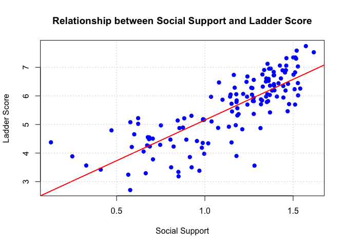

DS 202 Final Project
================

<!-- README.md is generated from README.Rmd. Please edit the README.Rmd file -->

This repository serves as a starter repo for your final project, and
this Rmd is supposed to serve as a starter file for your project report.

# Analysis of Worldwide Ladder Score

Authors: Cassandra Larsen, Chen Sang

## Abstract (TL;DR) ??? dk if we actually need it

An abstract is a quick summary of your work. Ideally it should motivate
someone to read the rest of the paper. Include one sentence each on

- what is the project about?
  - Since we are graduating soon, and we would like to find out the
    country that with the highest ladder score
- what is the motivation for doing it?
  - so that we can move there in order to save my mental health
- what data is your work based on? and where does it come from? = what
  are your main findings? (one sentence each)
  - ?????

# Intro

The goal of this project is to finding the best countries to live and
analyzing what factors contributed to the ladder score the most and the
least.

In pursuit of the stated goal, we will explore the following questions:

#### **Trend Analysis:**

- What is the relationship between the ‘Ladder score’ and ‘GDP per
  capita’?

- Does ‘Social support’ correlate strongly with the ‘Ladder score’?

**Comparative Analysis**:

- Which countries have the highest ‘Ladder score’?

- How do factors like ‘Generosity’ and ‘Perceptions of corruption’ vary
  among the top 5 happiest countries compared to the bottom 5?

**Distribution Analysis**:

- What is the distribution of the ‘Ladder score’ across all countries?
  Is it normally distributed?

- How does the distribution of ‘Healthy life expectancy’ compare to that
  of ‘Freedom to make life choices’?

Those are the questions we would like to explore in order to achieve the
goal and gain insightful thoughts.

# Quick Data Summary

What are the variables that you will be using in the main part of the
report? What are their ranges? You could include a table with variable
names, a short explanation, and (very broad) summary statistics.

**Cleaning data:**

    ##  [1] "Country_name"                             
    ##  [2] "Ladder_score"                             
    ##  [3] "upperwhisker"                             
    ##  [4] "lowerwhisker"                             
    ##  [5] "Explained_by_Log_GDP_per_capita"          
    ##  [6] "Explained_by_Social_support"              
    ##  [7] "Explained_by_Healthy_life_expectancy"     
    ##  [8] "Explained_by_Freedom_to_make_life_choices"
    ##  [9] "Explained_by_Generosity"                  
    ## [10] "Explained_by_Perceptions_of_corruption"   
    ## [11] "Dystopia_residual"

    ##                  Country_name Ladder_score upperwhisker lowerwhisker
    ## 1                     Finland        7.741        7.815        7.667
    ## 2                     Denmark        7.583        7.665        7.500
    ## 3                     Iceland        7.525        7.618        7.433
    ## 4                      Sweden        7.344        7.422        7.267
    ## 5                      Israel        7.341        7.405        7.277
    ## 6                 Netherlands        7.319        7.383        7.256
    ## 7                      Norway        7.302        7.389        7.215
    ## 8                  Luxembourg        7.122        7.213        7.031
    ## 9                 Switzerland        7.060        7.147        6.973
    ## 10                  Australia        7.057        7.141        6.973
    ## 11                New Zealand        7.029        7.105        6.954
    ## 12                 Costa Rica        6.955        7.051        6.860
    ## 13                     Kuwait        6.951        7.060        6.843
    ## 14                    Austria        6.905        6.986        6.824
    ## 15                     Canada        6.900        6.984        6.815
    ## 16                    Belgium        6.894        6.961        6.827
    ## 17                    Ireland        6.838        6.927        6.749
    ## 18                    Czechia        6.822        6.903        6.741
    ## 19                  Lithuania        6.818        6.896        6.739
    ## 20             United Kingdom        6.749        6.833        6.665
    ## 21                   Slovenia        6.743        6.843        6.643
    ## 22       United Arab Emirates        6.733        6.823        6.643
    ## 23              United States        6.725        6.818        6.631
    ## 24                    Germany        6.719        6.815        6.622
    ## 25                     Mexico        6.678        6.781        6.575
    ## 26                    Uruguay        6.611        6.696        6.527
    ## 27                     France        6.609        6.685        6.533
    ## 28               Saudi Arabia        6.594        6.707        6.480
    ## 29                     Kosovo        6.561        6.667        6.455
    ## 30                  Singapore        6.523        6.605        6.440
    ## 31   Taiwan Province of China        6.503        6.597        6.410
    ## 32                    Romania        6.491        6.592        6.390
    ## 33                El Salvador        6.469        6.599        6.338
    ## 34                    Estonia        6.448        6.524        6.371
    ## 35                     Poland        6.442        6.513        6.370
    ## 36                      Spain        6.421        6.502        6.339
    ## 37                     Serbia        6.411        6.522        6.300
    ## 38                      Chile        6.360        6.448        6.273
    ## 39                     Panama        6.358        6.489        6.227
    ## 40                      Malta        6.346        6.430        6.261
    ## 41                      Italy        6.324        6.436        6.211
    ## 42                  Guatemala        6.287        6.457        6.117
    ## 43                  Nicaragua        6.284        6.433        6.135
    ## 44                     Brazil        6.272        6.390        6.154
    ## 45                   Slovakia        6.257        6.332        6.182
    ## 46                     Latvia        6.234        6.314        6.155
    ## 47                 Uzbekistan        6.195        6.303        6.087
    ## 48                  Argentina        6.188        6.306        6.070
    ## 49                 Kazakhstan        6.188        6.278        6.097
    ## 50                     Cyprus        6.068        6.182        5.954
    ## 51                      Japan        6.060        6.144        5.976
    ## 52                South Korea        6.058        6.148        5.968
    ## 53                Philippines        6.048        6.166        5.929
    ## 54                    Vietnam        6.043        6.138        5.948
    ## 55                   Portugal        6.030        6.134        5.925
    ## 56                    Hungary        6.017        6.124        5.910
    ## 57                   Paraguay        5.977        6.085        5.868
    ## 58                   Thailand        5.976        6.094        5.858
    ## 59                   Malaysia        5.975        6.078        5.872
    ## 60                      China        5.973        6.061        5.885
    ## 61                   Honduras        5.968        6.114        5.822
    ## 63                    Croatia        5.942        6.047        5.837
    ## 64                     Greece        5.934        6.027        5.840
    ## 65     Bosnia and Herzegovina        5.877        5.979        5.775
    ## 66                      Libya        5.866        5.987        5.746
    ## 67                    Jamaica        5.842        6.059        5.624
    ## 68                       Peru        5.841        5.946        5.736
    ## 69         Dominican Republic        5.823        5.967        5.679
    ## 70                  Mauritius        5.816        5.927        5.706
    ## 71                    Moldova        5.816        5.930        5.702
    ## 72                     Russia        5.785        5.859        5.712
    ## 73                    Bolivia        5.784        5.895        5.674
    ## 74                    Ecuador        5.725        5.850        5.599
    ## 75                 Kyrgyzstan        5.714        5.795        5.632
    ## 76                 Montenegro        5.707        5.815        5.599
    ## 77                   Mongolia        5.696        5.783        5.610
    ## 78                   Colombia        5.695        5.806        5.584
    ## 79                  Venezuela        5.607        5.725        5.489
    ## 80                  Indonesia        5.568        5.670        5.466
    ## 81                   Bulgaria        5.463        5.569        5.357
    ## 82                    Armenia        5.455        5.560        5.350
    ## 83               South Africa        5.422        5.549        5.295
    ## 84            North Macedonia        5.369        5.468        5.270
    ## 85                    Algeria        5.364        5.476        5.251
    ## 86  Hong Kong S.A.R. of China        5.316        5.403        5.229
    ## 87                    Albania        5.304        5.440        5.168
    ## 89        Congo (Brazzaville)        5.221        5.396        5.047
    ## 90                 Mozambique        5.216        5.406        5.027
    ## 91                    Georgia        5.185        5.283        5.087
    ## 92                       Iraq        5.166        5.283        5.049
    ## 93                      Nepal        5.158        5.290        5.027
    ## 94                       Laos        5.139        5.261        5.017
    ## 95                      Gabon        5.106        5.243        4.969
    ## 96                Ivory Coast        5.080        5.224        4.936
    ## 97                     Guinea        5.023        5.166        4.881
    ## 98                    Turkiye        4.975        5.085        4.866
    ## 99                    Senegal        4.969        5.096        4.841
    ## 100                      Iran        4.923        5.024        4.822
    ## 101                Azerbaijan        4.893        5.018        4.768
    ## 102                   Nigeria        4.881        5.018        4.744
    ## 104                  Cameroon        4.874        4.996        4.753
    ## 105                   Ukraine        4.873        4.988        4.758
    ## 106                   Namibia        4.832        4.958        4.705
    ## 107                   Morocco        4.795        4.912        4.677
    ## 108                  Pakistan        4.657        4.779        4.535
    ## 109                     Niger        4.556        4.712        4.401
    ## 110              Burkina Faso        4.548        4.686        4.410
    ## 111                Mauritania        4.505        4.673        4.337
    ## 112                    Gambia        4.485        4.625        4.344
    ## 113                      Chad        4.471        4.630        4.313
    ## 114                     Kenya        4.470        4.595        4.344
    ## 115                   Tunisia        4.422        4.505        4.338
    ## 116                     Benin        4.377        4.510        4.245
    ## 117                    Uganda        4.372        4.501        4.243
    ## 118                   Myanmar        4.354        4.501        4.208
    ## 119                  Cambodia        4.341        4.446        4.236
    ## 120                     Ghana        4.289        4.396        4.182
    ## 121                   Liberia        4.269        4.474        4.063
    ## 122                      Mali        4.232        4.347        4.117
    ## 123                Madagascar        4.228        4.359        4.097
    ## 124                      Togo        4.214        4.330        4.098
    ## 125                    Jordan        4.186        4.306        4.066
    ## 126                     India        4.054        4.123        3.985
    ## 127                     Egypt        3.977        4.066        3.887
    ## 128                 Sri Lanka        3.898        4.018        3.778
    ## 129                Bangladesh        3.886        3.994        3.778
    ## 130                  Ethiopia        3.861        3.997        3.725
    ## 131                  Tanzania        3.781        3.917        3.644
    ## 132                   Comoros        3.566        3.754        3.378
    ## 133                     Yemen        3.561        3.714        3.408
    ## 134                    Zambia        3.502        3.636        3.368
    ## 135                  Eswatini        3.502        3.673        3.331
    ## 136                    Malawi        3.421        3.561        3.281
    ## 137                  Botswana        3.383        3.558        3.209
    ## 138                  Zimbabwe        3.341        3.457        3.226
    ## 139          Congo (Kinshasa)        3.295        3.462        3.128
    ## 140              Sierra Leone        3.245        3.366        3.124
    ## 141                   Lesotho        3.186        3.469        2.904
    ## 142                   Lebanon        2.707        2.797        2.616
    ## 143               Afghanistan        1.721        1.775        1.667
    ##     Explained_by_Log_GDP_per_capita Explained_by_Social_support
    ## 1                             1.844                       1.572
    ## 2                             1.908                       1.520
    ## 3                             1.881                       1.617
    ## 4                             1.878                       1.501
    ## 5                             1.803                       1.513
    ## 6                             1.901                       1.462
    ## 7                             1.952                       1.517
    ## 8                             2.141                       1.355
    ## 9                             1.970                       1.425
    ## 10                            1.854                       1.461
    ## 11                            1.810                       1.527
    ## 12                            1.561                       1.373
    ## 13                            1.845                       1.364
    ## 14                            1.885                       1.336
    ## 15                            1.840                       1.459
    ## 16                            1.868                       1.440
    ## 17                            2.129                       1.390
    ## 18                            1.783                       1.511
    ## 19                            1.766                       1.454
    ## 20                            1.822                       1.326
    ## 21                            1.786                       1.502
    ## 22                            1.983                       1.164
    ## 23                            1.939                       1.392
    ## 24                            1.871                       1.390
    ## 25                            1.521                       1.241
    ## 26                            1.596                       1.431
    ## 27                            1.818                       1.348
    ## 28                            1.842                       1.361
    ## 29                            1.364                       1.277
    ## 30                            2.118                       1.361
    ## 31                            1.842                       1.346
    ## 32                            1.699                       1.236
    ## 33                            1.265                       1.080
    ## 34                            1.752                       1.527
    ## 35                            1.738                       1.417
    ## 36                            1.766                       1.471
    ## 37                            1.538                       1.391
    ## 38                            1.616                       1.369
    ## 39                            1.702                       1.392
    ## 40                            1.827                       1.444
    ## 41                            1.800                       1.328
    ## 42                            1.260                       1.169
    ## 43                            1.097                       1.263
    ## 44                            1.430                       1.269
    ## 45                            1.706                       1.540
    ## 46                            1.700                       1.508
    ## 47                            1.212                       1.394
    ## 48                            1.562                       1.381
    ## 49                            1.622                       1.457
    ## 50                            1.794                       1.217
    ## 51                            1.786                       1.354
    ## 52                            1.815                       1.178
    ## 53                            1.232                       1.146
    ## 54                            1.331                       1.267
    ## 55                            1.728                       1.368
    ## 56                            1.722                       1.528
    ## 57                            1.398                       1.408
    ## 58                            1.484                       1.347
    ## 59                            1.646                       1.143
    ## 60                            1.497                       1.239
    ## 61                            1.091                       1.035
    ## 63                            1.710                       1.445
    ## 64                            1.684                       1.276
    ## 65                            1.465                       1.318
    ## 66                            1.526                       1.100
    ## 67                            1.280                       1.324
    ## 68                            1.371                       1.180
    ## 69                            1.517                       1.272
    ## 70                            1.570                       1.358
    ## 71                            1.385                       1.277
    ## 72                            1.642                       1.351
    ## 73                            1.217                       1.179
    ## 74                            1.315                       1.151
    ## 75                            1.054                       1.477
    ## 76                            1.571                       1.318
    ## 77                            1.353                       1.511
    ## 78                            1.437                       1.241
    ## 79                            0.000                       1.321
    ## 80                            1.361                       1.184
    ## 81                            1.629                       1.469
    ## 82                            1.444                       1.154
    ## 83                            1.389                       1.369
    ## 84                            1.475                       1.277
    ## 85                            1.324                       1.191
    ## 86                            1.909                       1.184
    ## 87                            1.438                       0.924
    ## 89                            0.892                       0.622
    ## 90                            0.560                       0.883
    ## 91                            1.467                       0.990
    ## 92                            1.249                       0.996
    ## 93                            0.965                       0.990
    ## 94                            1.208                       0.846
    ## 95                            1.403                       1.038
    ## 96                            1.080                       0.578
    ## 97                            0.831                       0.622
    ## 98                            1.702                       1.175
    ## 99                            0.927                       0.751
    ## 100                           1.435                       1.136
    ## 101                           1.433                       0.876
    ## 102                           1.042                       1.075
    ## 104                           0.943                       0.856
    ## 105                           1.350                       1.315
    ## 106                           1.266                       1.212
    ## 107                           1.213                       0.471
    ## 108                           1.069                       0.600
    ## 109                           0.573                       0.677
    ## 110                           0.756                       0.685
    ## 111                           1.078                       0.705
    ## 112                           0.750                       0.684
    ## 113                           0.603                       0.805
    ## 114                           1.037                       0.895
    ## 115                           1.306                       0.955
    ## 116                           0.914                       0.128
    ## 117                           0.772                       1.151
    ## 118                           0.978                       0.988
    ## 119                           1.011                       1.019
    ## 120                           1.077                       0.747
    ## 121                           0.619                       0.673
    ## 122                           0.747                       0.688
    ## 123                           0.628                       0.823
    ## 124                           0.758                       0.586
    ## 125                           1.262                       0.983
    ## 126                           1.166                       0.653
    ## 127                           1.370                       0.996
    ## 128                           1.361                       1.179
    ## 129                           1.122                       0.249
    ## 130                           0.792                       0.915
    ## 131                           0.820                       0.706
    ## 132                           0.896                       0.328
    ## 133                           0.671                       1.281
    ## 134                           0.899                       0.809
    ## 135                           1.255                       0.925
    ## 136                           0.617                       0.410
    ## 137                           1.445                       0.969
    ## 138                           0.748                       0.850
    ## 139                           0.534                       0.665
    ## 140                           0.654                       0.566
    ## 141                           0.771                       0.851
    ## 142                           1.377                       0.577
    ## 143                           0.628                       0.000
    ##     Explained_by_Healthy_life_expectancy
    ## 1                                  0.695
    ## 2                                  0.699
    ## 3                                  0.718
    ## 4                                  0.724
    ## 5                                  0.740
    ## 6                                  0.706
    ## 7                                  0.704
    ## 8                                  0.708
    ## 9                                  0.747
    ## 10                                 0.692
    ## 11                                 0.673
    ## 12                                 0.661
    ## 13                                 0.661
    ## 14                                 0.696
    ## 15                                 0.701
    ## 16                                 0.690
    ## 17                                 0.700
    ## 18                                 0.638
    ## 19                                 0.598
    ## 20                                 0.672
    ## 21                                 0.695
    ## 22                                 0.563
    ## 23                                 0.542
    ## 24                                 0.702
    ## 25                                 0.544
    ## 26                                 0.592
    ## 27                                 0.727
    ## 28                                 0.511
    ## 29                                 0.599
    ## 30                                 0.769
    ## 31                                 0.650
    ## 32                                 0.583
    ## 33                                 0.549
    ## 34                                 0.657
    ## 35                                 0.639
    ## 36                                 0.729
    ## 37                                 0.585
    ## 38                                 0.673
    ## 39                                 0.633
    ## 40                                 0.707
    ## 41                                 0.720
    ## 42                                 0.467
    ## 43                                 0.542
    ## 44                                 0.548
    ## 45                                 0.638
    ## 46                                 0.564
    ## 47                                 0.539
    ## 48                                 0.585
    ## 49                                 0.556
    ## 50                                 0.744
    ## 51                                 0.785
    ## 52                                 0.770
    ## 53                                 0.441
    ## 54                                 0.539
    ## 55                                 0.699
    ## 56                                 0.596
    ## 57                                 0.549
    ## 58                                 0.620
    ## 59                                 0.540
    ## 60                                 0.629
    ## 61                                 0.502
    ## 63                                 0.637
    ## 64                                 0.696
    ## 65                                 0.587
    ## 66                                 0.550
    ## 67                                 0.567
    ## 68                                 0.662
    ## 69                                 0.511
    ## 70                                 0.490
    ## 71                                 0.542
    ## 72                                 0.531
    ## 73                                 0.488
    ## 74                                 0.640
    ## 75                                 0.588
    ## 76                                 0.587
    ## 77                                 0.400
    ## 78                                 0.648
    ## 79                                 0.491
    ## 80                                 0.472
    ## 81                                 0.567
    ## 82                                 0.603
    ## 83                                 0.322
    ## 84                                 0.569
    ## 85                                 0.568
    ## 86                                 0.857
    ## 87                                 0.638
    ## 89                                 0.306
    ## 90                                 0.156
    ## 91                                 0.524
    ## 92                                 0.498
    ## 93                                 0.443
    ## 94                                 0.423
    ## 95                                 0.344
    ## 96                                 0.288
    ## 97                                 0.236
    ## 98                                 0.631
    ## 99                                 0.392
    ## 100                                0.571
    ## 101                                0.496
    ## 102                                0.256
    ## 104                                0.288
    ## 105                                0.513
    ## 106                                0.307
    ## 107                                0.495
    ## 108                                0.321
    ## 109                                0.293
    ## 110                                0.274
    ## 111                                0.400
    ## 112                                0.330
    ## 113                                0.199
    ## 114                                0.353
    ## 115                                0.579
    ## 116                                0.284
    ## 117                                0.373
    ## 118                                0.436
    ## 119                                0.442
    ## 120                                0.360
    ## 121                                0.301
    ## 122                                0.267
    ## 123                                0.333
    ## 124                                0.320
    ## 125                                0.594
    ## 126                                0.417
    ## 127                                0.488
    ## 128                                0.586
    ## 129                                0.513
    ## 130                                0.420
    ## 131                                0.380
    ## 132                                0.370
    ## 133                                0.293
    ## 134                                0.264
    ## 135                                0.176
    ## 136                                0.349
    ## 137                                0.241
    ## 138                                0.232
    ## 139                                0.262
    ## 140                                0.253
    ## 141                                0.000
    ## 142                                0.556
    ## 143                                0.242
    ##     Explained_by_Freedom_to_make_life_choices Explained_by_Generosity
    ## 1                                       0.859                   0.142
    ## 2                                       0.823                   0.204
    ## 3                                       0.819                   0.258
    ## 4                                       0.838                   0.221
    ## 5                                       0.641                   0.153
    ## 6                                       0.725                   0.247
    ## 7                                       0.835                   0.224
    ## 8                                       0.801                   0.146
    ## 9                                       0.759                   0.173
    ## 10                                      0.756                   0.225
    ## 11                                      0.746                   0.226
    ## 12                                      0.797                   0.109
    ## 13                                      0.827                   0.200
    ## 14                                      0.703                   0.214
    ## 15                                      0.730                   0.230
    ## 16                                      0.729                   0.170
    ## 17                                      0.758                   0.205
    ## 18                                      0.787                   0.177
    ## 19                                      0.533                   0.044
    ## 20                                      0.713                   0.267
    ## 21                                      0.789                   0.157
    ## 22                                      0.815                   0.209
    ## 23                                      0.586                   0.223
    ## 24                                      0.700                   0.174
    ## 25                                      0.722                   0.086
    ## 26                                      0.775                   0.106
    ## 27                                      0.650                   0.112
    ## 28                                      0.787                   0.114
    ## 29                                      0.739                   0.254
    ## 30                                      0.743                   0.168
    ## 31                                      0.649                   0.068
    ## 32                                      0.717                   0.041
    ## 33                                      0.816                   0.083
    ## 34                                      0.805                   0.166
    ## 35                                      0.600                   0.081
    ## 36                                      0.619                   0.119
    ## 37                                      0.663                   0.200
    ## 38                                      0.651                   0.117
    ## 39                                      0.720                   0.063
    ## 40                                      0.727                   0.250
    ## 41                                      0.513                   0.112
    ## 42                                      0.735                   0.105
    ## 43                                      0.793                   0.133
    ## 44                                      0.685                   0.130
    ## 45                                      0.566                   0.096
    ## 46                                      0.666                   0.127
    ## 47                                      0.835                   0.251
    ## 48                                      0.681                   0.087
    ## 49                                      0.733                   0.149
    ## 50                                      0.529                   0.124
    ## 51                                      0.632                   0.023
    ## 52                                      0.555                   0.126
    ## 53                                      0.826                   0.099
    ## 54                                      0.843                   0.094
    ## 55                                      0.757                   0.047
    ## 56                                      0.581                   0.123
    ## 57                                      0.788                   0.131
    ## 58                                      0.756                   0.283
    ## 59                                      0.829                   0.226
    ## 60                                      0.704                   0.132
    ## 61                                      0.720                   0.175
    ## 63                                      0.469                   0.064
    ## 64                                      0.337                   0.018
    ## 65                                      0.621                   0.246
    ## 66                                      0.592                   0.111
    ## 67                                      0.647                   0.089
    ## 68                                      0.615                   0.078
    ## 69                                      0.730                   0.086
    ## 70                                      0.641                   0.123
    ## 71                                      0.695                   0.077
    ## 72                                      0.551                   0.138
    ## 73                                      0.719                   0.100
    ## 74                                      0.606                   0.087
    ## 75                                      0.834                   0.225
    ## 76                                      0.632                   0.110
    ## 77                                      0.501                   0.237
    ## 78                                      0.644                   0.072
    ## 79                                      0.518                   0.192
    ## 80                                      0.779                   0.399
    ## 81                                      0.620                   0.083
    ## 82                                      0.650                   0.051
    ## 83                                      0.537                   0.078
    ## 84                                      0.580                   0.194
    ## 85                                      0.247                   0.091
    ## 86                                      0.485                   0.147
    ## 87                                      0.690                   0.138
    ## 89                                      0.523                   0.124
    ## 90                                      0.728                   0.158
    ## 91                                      0.680                   0.000
    ## 92                                      0.425                   0.141
    ## 93                                      0.653                   0.209
    ## 94                                      0.796                   0.170
    ## 95                                      0.516                   0.045
    ## 96                                      0.547                   0.120
    ## 97                                      0.521                   0.210
    ## 98                                      0.202                   0.068
    ## 99                                      0.607                   0.152
    ## 100                                     0.366                   0.235
    ## 101                                     0.668                   0.112
    ## 102                                     0.566                   0.201
    ## 104                                     0.521                   0.126
    ## 105                                     0.631                   0.285
    ## 106                                     0.470                   0.069
    ## 107                                     0.631                   0.042
    ## 108                                     0.542                   0.144
    ## 109                                     0.615                   0.145
    ## 110                                     0.483                   0.173
    ## 111                                     0.343                   0.133
    ## 112                                     0.459                   0.324
    ## 113                                     0.411                   0.218
    ## 114                                     0.519                   0.282
    ## 115                                     0.254                   0.024
    ## 116                                     0.567                   0.112
    ## 117                                     0.587                   0.178
    ## 118                                     0.450                   0.401
    ## 119                                     0.863                   0.170
    ## 120                                     0.623                   0.183
    ## 121                                     0.546                   0.178
    ## 122                                     0.586                   0.120
    ## 123                                     0.250                   0.172
    ## 124                                     0.453                   0.127
    ## 125                                     0.593                   0.059
    ## 126                                     0.767                   0.174
    ## 127                                     0.490                   0.025
    ## 128                                     0.583                   0.144
    ## 129                                     0.775                   0.140
    ## 130                                     0.441                   0.270
    ## 131                                     0.709                   0.191
    ## 132                                     0.172                   0.128
    ## 133                                     0.362                   0.080
    ## 134                                     0.727                   0.168
    ## 135                                     0.284                   0.059
    ## 136                                     0.571                   0.135
    ## 137                                     0.567                   0.014
    ## 138                                     0.487                   0.096
    ## 139                                     0.473                   0.189
    ## 140                                     0.469                   0.181
    ## 141                                     0.523                   0.082
    ## 142                                     0.173                   0.068
    ## 143                                     0.000                   0.091
    ##     Explained_by_Perceptions_of_corruption Dystopia_residual
    ## 1                                    0.546             2.082
    ## 2                                    0.548             1.881
    ## 3                                    0.182             2.050
    ## 4                                    0.524             1.658
    ## 5                                    0.193             2.298
    ## 6                                    0.372             1.906
    ## 7                                    0.484             1.586
    ## 8                                    0.432             1.540
    ## 9                                    0.498             1.488
    ## 10                                   0.323             1.745
    ## 11                                   0.480             1.567
    ## 12                                   0.123             2.333
    ## 13                                   0.172             1.884
    ## 14                                   0.305             1.766
    ## 15                                   0.368             1.572
    ## 16                                   0.311             1.686
    ## 17                                   0.418             1.239
    ## 18                                   0.068             1.858
    ## 19                                   0.116             2.307
    ## 20                                   0.351             1.598
    ## 21                                   0.131             1.683
    ## 22                                   0.258             1.741
    ## 23                                   0.169             1.873
    ## 24                                   0.368             1.513
    ## 25                                   0.127             2.437
    ## 26                                   0.220             1.891
    ## 27                                   0.281             1.672
    ## 28                                   0.188             1.790
    ## 29                                   0.073             2.255
    ## 30                                   0.575             0.788
    ## 31                                   0.202             1.747
    ## 32                                   0.006             2.210
    ## 33                                   0.253             2.424
    ## 34                                   0.401             1.138
    ## 35                                   0.175             1.791
    ## 36                                   0.177             1.540
    ## 37                                   0.101             1.932
    ## 38                                   0.075             1.858
    ## 39                                   0.043             1.806
    ## 40                                   0.125             1.267
    ## 41                                   0.074             1.777
    ## 42                                   0.078             2.473
    ## 43                                   0.251             2.203
    ## 44                                   0.142             2.068
    ## 45                                   0.058             1.653
    ## 46                                   0.078             1.590
    ## 47                                   0.215             1.749
    ## 48                                   0.080             1.812
    ## 49                                   0.120             1.551
    ## 50                                   0.049             1.611
    ## 51                                   0.219             1.261
    ## 52                                   0.158             1.456
    ## 53                                   0.136             2.167
    ## 54                                   0.160             1.810
    ## 55                                   0.035             1.397
    ## 56                                   0.067             1.400
    ## 57                                   0.065             1.637
    ## 58                                   0.024             1.463
    ## 59                                   0.119             1.473
    ## 60                                   0.164             1.608
    ## 61                                   0.081             2.364
    ## 63                                   0.043             1.574
    ## 64                                   0.093             1.830
    ## 65                                   0.000             1.640
    ## 66                                   0.204             1.785
    ## 67                                   0.028             1.907
    ## 68                                   0.029             1.907
    ## 69                                   0.196             1.512
    ## 70                                   0.118             1.517
    ## 71                                   0.044             1.795
    ## 72                                   0.121             1.451
    ## 73                                   0.061             2.020
    ## 74                                   0.078             1.846
    ## 75                                   0.030             1.505
    ## 76                                   0.132             1.357
    ## 77                                   0.055             1.640
    ## 78                                   0.059             1.596
    ## 79                                   0.086             2.998
    ## 80                                   0.055             1.318
    ## 81                                   0.006             1.088
    ## 82                                   0.173             1.379
    ## 83                                   0.034             1.693
    ## 84                                   0.015             1.260
    ## 85                                   0.200             1.743
    ## 86                                   0.402             0.333
    ## 87                                   0.049             1.428
    ## 89                                   0.138             2.617
    ## 90                                   0.196             2.536
    ## 91                                   0.174             1.349
    ## 92                                   0.048             1.809
    ## 93                                   0.115             1.783
    ## 94                                   0.167             1.529
    ## 95                                   0.100             1.660
    ## 96                                   0.164             2.303
    ## 97                                   0.107             2.497
    ## 98                                   0.115             1.083
    ## 99                                   0.069             2.071
    ## 100                                  0.123             1.057
    ## 101                                  0.199             1.110
    ## 102                                  0.019             1.722
    ## 104                                  0.060             2.080
    ## 105                                  0.025             0.753
    ## 106                                  0.061             1.446
    ## 107                                  0.082             1.861
    ## 108                                  0.074             1.907
    ## 109                                  0.147             2.107
    ## 110                                  0.179             1.999
    ## 111                                  0.198             1.649
    ## 112                                  0.048             1.890
    ## 113                                  0.113             2.122
    ## 114                                  0.069             1.316
    ## 115                                  0.018             1.285
    ## 116                                  0.252             2.121
    ## 117                                  0.054             1.256
    ## 118                                  0.174             0.928
    ## 119                                  0.071             0.765
    ## 120                                  0.028             1.273
    ## 121                                  0.075             1.878
    ## 122                                  0.090             1.734
    ## 123                                  0.123             1.897
    ## 124                                  0.156             1.814
    ## 125                                  0.189             0.504
    ## 126                                  0.122             0.756
    ## 127                                  0.259             0.349
    ## 128                                  0.031             0.014
    ## 129                                  0.167             0.919
    ## 130                                  0.101             0.923
    ## 131                                  0.257             0.717
    ## 132                                  0.160             1.512
    ## 133                                  0.113             0.760
    ## 134                                  0.109             0.526
    ## 135                                  0.116             0.686
    ## 136                                  0.136             1.203
    ## 137                                  0.082             0.066
    ## 138                                  0.131             0.797
    ## 139                                  0.072             1.102
    ## 140                                  0.053             1.068
    ## 141                                  0.085             0.875
    ## 142                                  0.029            -0.073
    ## 143                                  0.088             0.672

# Results

### **Trend Analysis:**

- **What is the relationship between the ‘Ladder score’ and ‘GDP per
  capita’?**

  - A linear regression analysis can help us understand how much of the
    variation in **`Ladder_score`** can be explained by
    **`Explained_by_Log_GDP_per_capita`**

  <!-- -->

      ## 
      ## Call:
      ## lm(formula = Ladder_score ~ Explained_by_Log_GDP_per_capita, 
      ##     data = clean_Happy_data)
      ## 
      ## Residuals:
      ##      Min       1Q   Median       3Q      Max 
      ## -2.82003 -0.37094  0.05679  0.40998  3.02053 
      ## 
      ## Coefficients:
      ##                                 Estimate Std. Error t value Pr(>|t|)    
      ## (Intercept)                       2.5865     0.2183   11.85   <2e-16 ***
      ## Explained_by_Log_GDP_per_capita   2.1355     0.1514   14.11   <2e-16 ***
      ## ---
      ## Signif. codes:  0 '***' 0.001 '**' 0.01 '*' 0.05 '.' 0.1 ' ' 1
      ## 
      ## Residual standard error: 0.7585 on 138 degrees of freedom
      ## Multiple R-squared:  0.5906, Adjusted R-squared:  0.5876 
      ## F-statistic: 199.1 on 1 and 138 DF,  p-value: < 2.2e-16

  <!-- -->

  - **Positive Relationship**: There’s a clear positive correlation
    between Log GDP per Capita and Ladder Score. This suggests that as
    the economic output per capita increases, the happiness score tends
    to increase as well. This is indicated by the upward slope of the
    red regression line.

  - **Strength of the Relationship**: The spread of the blue points
    around the regression line suggests that while GDP per capita
    explains a significant portion of the variance in happiness scores,
    there are also other factors that influence happiness since the
    points are not perfectly aligned along the line. This is consistent
    with the R-squared value from your regression summary (approximately
    0.59), indicating that around 59% of the variation in Ladder Score
    can be explained by GDP per capita.

  - **Statistical Significance**: The regression coefficients for the
    intercept and Log GDP per capita are both statistically significant
    (p-values \< 2.2e-16), indicating a very low probability that these
    results are due to random chance.

**Does ‘Social support’ correlate strongly with the ‘Ladder score’?**

- Pearson correlation coefficient, which quantifies the strength and
  direction of the relationship, and to create a scatter plot with a
  regression line to visually assess the relationship.

<!-- -->

    ## [1] "Pearson correlation coefficient between Social Support and Ladder Score is: 0.813542001508389"

<!-- -->

- **`cor()`**: Computes the Pearson correlation coefficient between the
  two variables. The **`use = "complete.obs"`** argument tells R to use
  only complete cases, ignoring pairs with missing values.

- **`plot()`**: Generates a scatter plot of the two variables.

- **`lm()`** and **`abline()`**: Fit a linear regression model to the
  data and plot the regression line, showing the best linear fit through
  the data points.

- **`grid()`**: Adds a grid to the plot for easier visual analysis.

The Pearson correlation coefficient will give you a numerical value
between -1 and 1 where:

- **1** indicates a perfect positive linear relationship,

- **-1** indicates a perfect negative linear relationship,

- **0** means no linear relationship.

The scatter plot with the regression line will help visually confirm the
relationship and see how tightly the data points cluster around the
line, which reflects the strength of the correlation.

- **Strength of Relationship**: A correlation coefficient of 0.81 is
  quite high, suggesting a strong association between the levels of
  social support in a country and its reported happiness (Ladder Score).

- **Direction of Relationship**: Since the correlation coefficient is
  positive, it means that as social support increases, the Ladder Score
  generally increases as well. This implies that countries with higher
  levels of social support tend to have higher happiness scores.

### **Comparative Analysis**:

- **Which countries have the highest ‘Ladder score’?**

- **How do factors like ‘Generosity’ and ‘Perceptions of corruption’
  vary among the top 5 happiest countries compared to the bottom 5?**

  **Identify TOP 5 countries with highest ladder score:**

      ## [1] "Top 5 happiest countries based on Ladder Score:"

      ## [1] "Finland" "Denmark" "Iceland" "Sweden"  "Israel"

  #### Analyze Generosity and Perceptions of corruption in Top 5 vs. Bottom 5 Countries

      ## [1] "Bottom 5 countries based on Ladder Score:"

      ## [1] "Congo (Kinshasa)" "Sierra Leone"     "Lesotho"          "Lebanon"         
      ## [5] "Afghanistan"

      ## [1] "Generosity and Perceptions of Corruption in the Top 5 happiest countries:"

      ##   Country_name Explained_by_Generosity Explained_by_Perceptions_of_corruption
      ## 1      Finland                   0.142                                  0.546
      ## 2      Denmark                   0.204                                  0.548
      ## 3      Iceland                   0.258                                  0.182
      ## 4       Sweden                   0.221                                  0.524
      ## 5       Israel                   0.153                                  0.193

      ## [1] "Generosity and Perceptions of Corruption in the Bottom 5 countries:"

      ##         Country_name Explained_by_Generosity
      ## 139 Congo (Kinshasa)                   0.189
      ## 140     Sierra Leone                   0.181
      ## 141          Lesotho                   0.082
      ## 142          Lebanon                   0.068
      ## 143      Afghanistan                   0.091
      ##     Explained_by_Perceptions_of_corruption
      ## 139                                  0.072
      ## 140                                  0.053
      ## 141                                  0.085
      ## 142                                  0.029
      ## 143                                  0.088

  <!-- -->

  <!-- -->

  ### **Perceptions of Corruption Graph Analysis**

  1.  **Lower Corruption in Happier Countries**: The top 5 happiest
      countries (Denmark, Finland, Sweden, Israel, Iceland) have
      significantly lower perceptions of corruption compared to the
      bottom 5 (Afghanistan, Lesotho, Congo (Kinshasa), Sierra Leone,
      Lebanon). This indicates a trend where higher happiness levels
      correlate with lower perceived corruption.

  2.  **Uniformity Among Top Countries**: The top 5 countries show a
      relatively uniform low level of perceived corruption, suggesting a
      stable and trustworthy public sector which could be contributing
      to higher happiness scores.

- **Variability Among Less Happy Countries**: The bottom 5 countries
  display a wider range of perceptions of corruption. This variability
  might reflect differing levels of governance and institutional
  effectiveness, which can affect societal happiness.

  ### **Generosity Graph Analysis**

  1.  **Comparative Generosity**: While both the top 5 and bottom 5
      countries show variability in generosity, the top 5 happiest
      countries generally display higher levels of generosity compared
      to the bottom 5. This suggests that societal generosity could be
      associated with greater happiness.

  2.  **High Generosity Even in Less Happy Countries**: Notably, some of
      the less happy countries (e.g., Congo (Kinshasa) and Sierra Leone)
      still show significant levels of generosity. This indicates that
      despite economic or social challenges, cultural or societal norms
      in these countries may still promote generous behavior.

### **Distribution Analysis**:

- **What is the distribution of the ‘Ladder score’ across all countries?
  Is it normally distributed?**

  <!-- --><!-- -->

  ### **Histogram Analysis:**

  - **Shape of Distribution**: The histogram reveals a multi-modal
    distribution, indicating several peaks instead of one. The most
    pronounced peak is around a Ladder Score of 6, with smaller peaks
    around scores of 4 and 7.

  - **Skewness**: The distribution appears to be slightly left-skewed as
    there are more scores on the higher end (right side) than on the
    lower end (left side). This skewness suggests that more countries
    are clustered around higher happiness scores.

  - **Implication**: The presence of multiple peaks and slight skewness
    suggests that the Ladder Score distribution is not perfectly normal
    but instead shows variability in how happiness is distributed among
    countries.

  ### **Q-Q Plot Analysis:**

  - **Linearity**: The Q-Q plot, which plots the quantiles of your
    Ladder Score data against the quantiles of a theoretical normal
    distribution, shows a mostly linear pattern, suggesting that the
    scores are relatively normally distributed.

  - **Deviations**: However, note the slight deviations from the line at
    both the lower and higher ends of the distribution. These deviations
    are typical indicators of the heavy tails in the data — more extreme
    values (both low and high) than what a normal distribution would
    predict.

  - **Normality Assessment**: While the central part of the data closely
    follows the theoretical line (indicating normality), the deviations
    at the tails suggest that the distribution is not perfectly normal.
    This is typical in real-world data, especially with complex
    phenomena like happiness.

  ### **Conclusion:**

  The **`Ladder Score`** distribution across countries shows
  characteristics of normality but with notable deviations, particularly
  in the form of slight skewness and heavier tails. This suggests that
  while many countries have happiness scores that approximate a normal
  distribution, there are countries at both ends of the spectrum that
  deviate from this trend. These findings highlight the complexity of
  factors influencing national happiness and suggest that multiple modes
  of happiness exist across different groups or types of countries.

- **How does the distribution of ‘Healthy life expectancy’ compare to
  that of ‘Freedom to make life choices’?**

  <!-- --><!-- -->

  <!-- -->

### **Histogram Analysis**

1.  **Healthy Life Expectancy**:

    - The histogram for **`Healthy Life Expectancy`** is slightly
      right-skewed, with a major peak around 0.6. This suggests that
      most countries have a higher value for healthy life expectancy.

    - The distribution is not uniform and shows concentration in the mid
      to higher range, indicating variability in how different countries
      achieve healthy life expectancies.

2.  **Freedom to Make Life Choices**:

    - In contrast, the histogram for **`Freedom to Make Life Choices`**
      shows a roughly symmetric distribution with a strong central peak
      around 0.6 to 0.8. This indicates a clustering of countries where
      citizens perceive they have substantial freedom in making life
      choices.

    - The presence of smaller bars at both the lower and higher ends
      suggests that while many countries have high freedom, a few
      countries either have very high or very low perceived freedoms.

### **Density Plot Analysis**

- **Overlap and Distinction**:

  - The density plot provides a clearer visualization of how each
    distribution spreads out and peaks. Both variables share a similar
    range, but their distributions tell different stories.

  - **Healthy Life Expectancy** peaks earlier and has a longer tail
    towards higher values, consistent with the right skew seen in the
    histogram. This could reflect disparities in health services and
    outcomes among countries.

  - **Freedom to Make Life Choices** shows a more bell-shaped curve,
    peaking later than Healthy Life Expectancy and tapering off more
    symmetrically. This distribution is closer to normal, suggesting
    that perceptions of freedom are more uniformly distributed among the
    countries surveyed.

### **Interpretation and Implications**

- The comparison highlights that while there is a general global trend
  towards higher healthy life expectancies and freedom to make life
  choices, the variation in healthy life expectancy is more pronounced.
  This might be due to differing healthcare policies, economic
  conditions, and public health realities.

- The more uniform distribution of freedom to make life choices might
  suggest a global convergence towards recognizing and ensuring these
  freedoms, although extremes still exist.

## Data source

Where does the data come from, who owns the data? Where are all the
scripts that you need to clean the data?

I don’t remmeber this part.

## References

- Linear Regression: <https://r-statistics.co/Linear-Regression.html>

- Pearson Correlation in R:
  <https://www.geeksforgeeks.org/pearson-correlation-testing-in-r-programming/>

- Q-Q
  plot:<https://whitlockschluter3e.zoology.ubc.ca/Tutorials%20using%20R/R_tutorial_Normal_and_sample_means.html>
